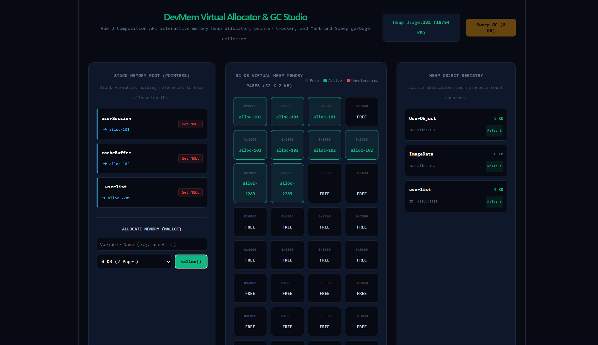

#  DevMem — Virtual Memory Allocator & Garbage Collection Studio (Vue.js)
---------------------------------------------------------------------------------------------------

DevMem is a low-level memory allocation and garbage collection simulator engineered with Vue 3 (Composition API `<script setup>`). It maps a 64 KB Virtual Heap across 32 memory pages, simulates dynamic stack pointer references, tracks heap fragmentation, and executes Mark-and-Sweep Garbage Collection sweeps to reclaim unreferenced memory.

##  Technical Architecture Overview
-------------------------------------------------------------------------

*  **Dynamic Heap Allocation (`malloc`):** Searches contiguous page blocks in virtual RAM arrays to allocate dynamic memory structures safely.
*  **Reference Counting & Pointer Severing:** Simulates stack root pointer dereferencing (`variable = null`), identifying unreachable heap objects.
*  **Mark-and-Sweep Garbage Collection:** Executes a two-phase GC sweep loop to free unreferenced pages and update memory registry telemetry.

##  Preview
---------------------------------------------------------------------------------------------------

